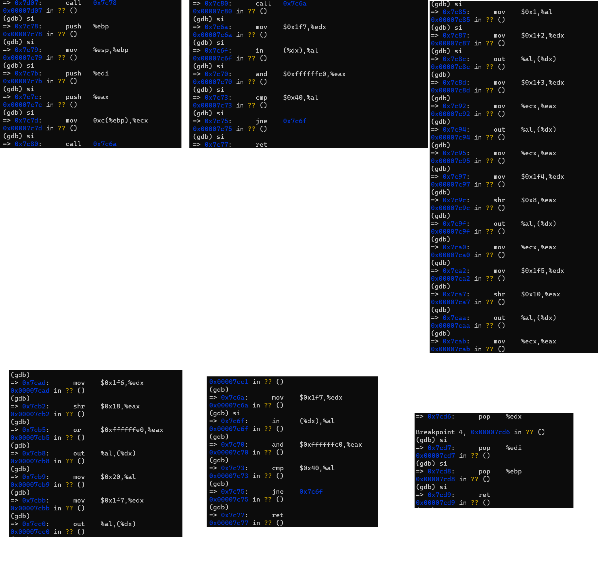
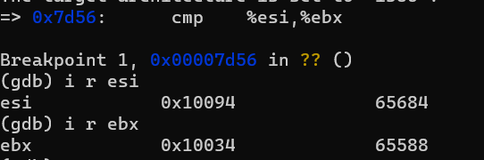
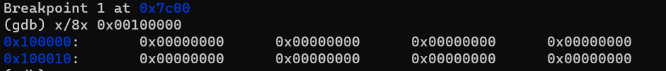
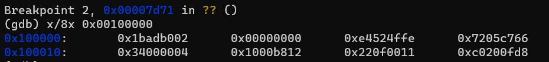
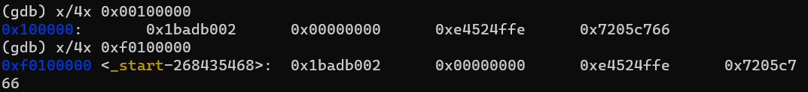
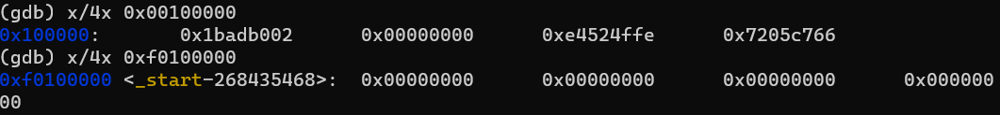

# Lab1

## Exercise 3

### Tracing readsect



### Identifying the begin and the end of the for loop



There are three more sectors being read. (0x10094 - 0x10034) / 0x20, where 0x20 is the size of the `struct Prohdr`.

### At what point does the processor start executing 32-bit code? What exactly causes the switch from 16- to 32-bit mode?

```assembly
movl %cr0, %eax
orl $CR0_PE_ON, %eax
movl %eax, %cr0
```

Once the `protected mode` bit is set, the 32-bit protected mode is turned on.

### What is the last instruction of the boot loader executed, and what is the first instruction of the kernel it just loaded?Where is the first instruction of the kernel?

```assembly
call   *0x10018
```

0x10018 stores the address of the first instruction of the kernel. The first instruction, located at 0x0010000c, is:

```assembly
movw $0x1234,0x472
```

### How does the boot loader decide how many sectors it must read in order to fetch the entire kernel from disk? Where does it find this information?

The bootloader reads the kernel from the first 8 sectors of the disk. The elf-format kernel has a Elf header, where the metadata, including how many programming segments, their positions, etc. is recorded.


## Exercise 5

### Trace through the first few instructions of the boot loader again and identify the first instruction that would "break" or otherwise do the wrong thing if you were to get the boot loader's link address wrong.

```assembly
ljmp    $PROT_MODE_CSEG, $protcseg
```

The BIOS automatically loads the bootloader to 0x7c00 and sequentially executes it. If the linking address is wrong, the jumping address is invalid against the actual position of the bootloader.


## Exercise 6

#### Reset the machine (exit QEMU/GDB and start them again). Examine the 8 words of memory at 0x00100000 at the point the BIOS enters the boot loader, and then again at the point the boot loader enters the kernel. Why are they different? What is there at the second breakpoint? (You do not really need to use QEMU to answer this question. Just think.)






The bootloader has read the kernel from the disk and placed it to the address, 0x0010000c, which is the entry point of the kernel.

## Exercise 7

### Use QEMU and GDB to trace into the JOS kernel and stop at the movl %eax, %cr0. Examine memory at 0x00100000 and at 0xf0100000. Now, single step over that instruction using the stepi GDB command. Again, examine memory at 0x00100000 and at 0xf0100000. Make sure you understand what just happened.



After executing `movl %eax, %cr0`, the content in 0xf0100000 becomes the content in 0x00100000 before executing, because the `movl %eax, %cr0` turned on the paging mode and the system uses virtual address after this command. The little page table maps the high address space to the low address space. The 4MB virtual space from the kernel base address, 0xF0000000 to KERNBASE>>PDXSHIFT is mapped to the physical address [0-4MB). To make system compatible, the low address space is also linked to the [0-4MB) physical address. 

### What is the first instruction after the new mapping is established that would fail to work properly if the mapping weren't in place? Comment out the movl %eax, %cr0 in kern/entry.S, trace into it, and see if you were right.

```assembly
jmp    *%eax
```

The `eax` stores the virtual address 0xf010002f. If the page table and directory are not set properly, this high address space would fail to execute. Similarly, if the low virtual address space is not mapped to the low physical address, the subsequent instruction of the `movl %eax, %cr0` may fail.

## Exercise 8

### We have omitted a small fragment of code - the code necessary to print octal numbers using patterns of the form "%o". Find and fill in this code fragment.

```c
...
num = getuint(&ap, lflag);
base = 8;
printnum(putch, putdat, num, base, width, padc);
break;
...
```

### Explain the interface between printf.c and console.c. Specifically, what function does console.c export? How is this function used by printf.c?

The `console.c` exports functions that directly write byte to hardware's ports. The `cputchar(int c)` provides a way to print a character to the screen, where the `cons_putc(int c)`is invoked to write character to the hardware's buffer.

The `cputchar` is invoked by the function `putch(int, int*)` in the `printf.c`, which is the fundamental output function of all the `printf` functions.

### Explain the following from console.c:

```c
if (crt_pos >= CRT_SIZE) {
    int i;
    memmove(crt_buf, crt_buf + CRT_COLS, (CRT_SIZE - CRT_COLS) * sizeof(uint16_t));
    for (i = CRT_SIZE - CRT_COLS; i < CRT_SIZE; i++)
        crt_buf[i] = 0x0700 | ' ';
    crt_pos -= CRT_COLS;
}
```

If the screen buffer is full, eliminates the first row of the buffer (`crt_buf + CRT_COLS`), move the rest bytes to the beginning of the buffer, and fills the last row with blanks.

### In the call to cprintf(), to what does fmt point? To what does ap point?

- fmt points to 0xf0101ab7, where a string  "x %d, y %x, z %d\n" is stored.
- ap points to 0xf010efd4, storing the value 1.

### List (in order of execution) each call to cons_putc, va_arg, and vcprintf. For cons_putc, list its argument as well. For va_arg, list what ap points to before and after the call. For vcprintf list the values of its two arguments.

- vcprintf: 
  - fmt: the formatting string
  - ap: the head of the argument list.
- va_arg
  - ap: the head of the argument list
  - type: the type to convert the current argument
- cons_putc:
  - c: the character to output to the screen

After calling the `vcprintf`, the formatting string  and the `ap` would not be changed.

## Exercise 9

### Determine where the kernel initializes its stack, and exactly where in memory its stack is located. How does the kernel reserve space for its stack? And at which "end" of this reserved area is the stack pointer initialized to point to?

```assembly
.data
###################################################################
# boot stack
###################################################################
	.p2align	PGSHIFT		# force page alignment
	.globl		bootstack
bootstack:
	.space		KSTKSIZE
	.globl		bootstacktop   
bootstacktop:
```

The kernel announces a KSTKSIZE space for the stack and

```assembly
mov    $0x0,%ebp
mov    $(bootstacktop),%esp
```

initialize the stack by setting the stack pointer `esp` to the top of the current stack (the beginning address).

## Exercise 10

### To become familiar with the C calling conventions on the x86, find the address of the test_backtrace function in obj/kern/kernel.asm, set a breakpoint there, and examine what happens each time it gets called after the kernel starts. How many 32-bit words does each recursive nesting level of test_backtrace push on the stack, and what are those words?

```assembly
push   %ebp // push the stack base pointer to the new stack
mov    %esp,%ebp // save the current stack pointer
push   %esi // save the esi
push   %ebx // save the ebx
```

3 32-bit words would be saved before executing the `test_backtrace` function. The procedure of calling a function is described in detail in [Understanding how function call works](https://zhu45.org/posts/2017/Jul/30/understanding-how-function-call-works/).

## Exercise 11

### Implement the backtrace function as specified above. Use the same format as in the example, since otherwise the grading script will be confused. When you think you have it working right, run make grade to see if its output conforms to what our grading script expects, and fix it if it doesn't. After you have handed in your Lab 1 code, you are welcome to change the output format of the backtrace function any way you like.

1. read the current ebp
2. while the ebp is not point to zero
   - print the ebp
   - print the stack frame that is on the top of the ebp (eip, the return address)
   - print the 5 arguments that is on the top of the ebp (ebp + 2 to ebp + 6)
   - ebp = *ebp (find the previous ebp)


## Exercise 12

### Modify your stack backtrace function to display, for each eip, the function name, source file name, and line number corresponding to that eip.

1. In debuginfo_eip, where do` __STAB_*` come from? This question has a long answer; to help you to discover the answer, here are some things you might want to do:
2. look in the file `kern/kernel.ld` for` __STAB_* `
3. run `objdump -h obj/kern/kernel`
4. run `objdump -G obj/kern/kernel`
5. run `gcc -pipe -nostdinc -O2 -fno-builtin -I. -MD -Wall -Wno-format -DJOS_KERNEL -gstabs -c -S kern/init.c, and look at init.s`.
6. see if the bootloader loads the symbol table in memory as part of loading the kernel binary
   Complete the implementation of debuginfo_eip by inserting the call to stab_binsearch to find the line number for an address.

**Solution**: 

1.  dump the kernel symbol table with `-G`. Observing that `FUN` means the function symbol; `SLINE` represents the C source code; `SOL` is the name of the file.
2. The `stab_binsearch` searches the whole table and tries to find the specified kind of symbol in the given region.
3. The `n_desc` column stands for the actual line in the C source code files; The `n_value` is the instruction address (or the instruction offset within a function segment).