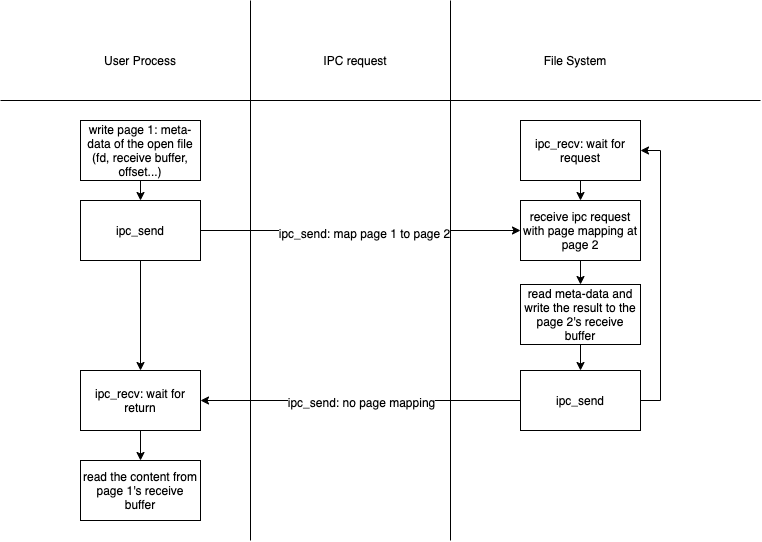

# lab5

## Filesystem overview

### boot
1. The FS is an independent process from the kernel with the I/O priviledge.
2. The kernel creates the FS process when initializing.

### FS management
1. The disk are divided into several blocks, 4KB each (matched with the page size).
2. The block 1 is the super block maitaining the meta-data for the whole filesystem (such as block size, disk size, etc.). The block 0 is the preserved block for the bootloader and the kernel image.
3. The struct `File` records the name, size, type, data block pointers, etc. for the file. The struct for each file is stored in the directories' data blocks. Note that, directories are special files in the system, whose `type` field is indicated as `FTYPE_DIR`.
4. The data blocks of a file stores the content. The data blocks of a directory stores the meta-data (i.e. struct `File`) for the files in it.
5. The `bitmap` indicates which blocks are in-use or free.
6. The disk can only be written by sectors (not block). When flushing the file in the memory, it's crucial to map the `block no` to the `sect no`.
7. The whole disk space can be mapped to the fs's user virtual memory space (3GB in total), which simplifies the procedure to check whether a file is read into the memory. The memory pages are unmapped when closing the file.
8. Each file has at least 10 direct data blocks, whose pointers are stored in the `f_direct` array in the struct `File`. Big files has a indirect block recording the data block pointers for the extra data blocks (at most 1024 data blocks).

## exercise 2-4

### bc_fault
1. Allocate a new page for the file and map the content to that page (just like the `pgfault` function for the `fork` syscall).

### flush_block
1. Write the memory page to the disk and reset the `dirty` bit (via `sys_page_map` syscall).
2. Do nothing if the page is not dirty.

### alloc_block
1. Allocate a free block.
2. Check if the page is free using the `bitmap`.
3. Mark as `in-use` when successfully allocating.
4. Note that only one bit for each block in the `bitmap`. Use bit operation to modify the entry in the `bitmap`.

### file_block_walk
1. Return the pointer to the designated `blockno`.
2. Search the data blocks of the specified `File`.
3. If the `blockno` exceeds the range of the `f_direct` array, then search in the `indirect` block.

### file_get_block
1. Wrapper of the `file_block_walk`
2. Return the block pointer of the designated `blockno`.
3. If the block doesn't exist currently, try allocating a new block and return.

## Exercise 5-8
1. The filesystem communicates with others processes via IPC.
2. The page would be mapped to requesting process's virtual space via IPC (the IPC interface in JOS can mapped the source page from the requested process to the requesting process) so that the user process can directly write/read the file.
3. For each open file, the filesystem maintains the offset, fd, mode, `File` for it.

### serv_read
1. Copy the content to the specified page and map it back to the requesting process.
2. The procedure is shown in the following figure

### serv_write
1. similar to the `serv_read`.

### spawn
1. Read the elf file from the filesystem.
2. `Fork` a new child process and set up its `trapframe` via `sys_set_env_trapframe` regarding the elf file.

### duppage: handling the PTE_SHARE pages
1. The open file in the parent process should not be copied (copy-on-write mechanism) when the child attempts to write on it.
2. Simply map the page as `PTE_U | PTE_W | PTE_P` to the child so that both processes can modify the same file.

## Exercise 9-10

### serial interrupt and keyboard interrupt
1. dispatch the interrupt in the `trap_dispatch` function.

### implement the input redirection operator <
1. Redirect the input file descriptor (0 in JOS) to the input file via `dup(target, new_fd)` syscall. 